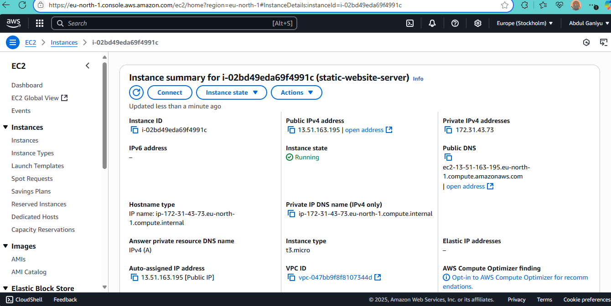
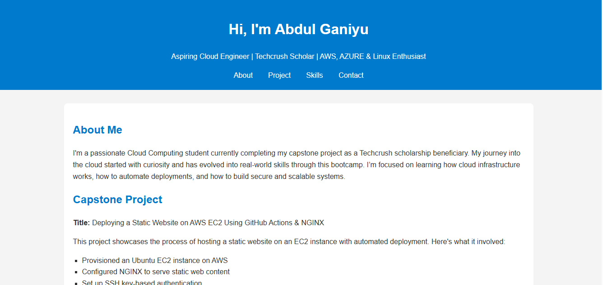

# 🚀 Static Website Deployment – Cloud Capstone Project

This project showcases the deployment of a **static website** on an **AWS EC2 instance** using **NGINX** and automated Bash scripting. It was completed as part of my Cloud Computing Capstone at **Techcrush Bootcamp**.

---

## 📌 Objective

To build and deploy a static portfolio website on a cloud platform (AWS EC2), demonstrating core cloud concepts like:

- Linux server provisioning
- Web server configuration (NGINX)
- Secure SSH access
- Infrastructure automation with Bash
- GitHub-based version control and CI/CD

---

## 🧰 Technologies & Tools Used

- **Amazon EC2 (Ubuntu 22.04)**
- **NGINX** – Web Server
- **HTML5**, **CSS3**, and **JavaScript**
- **Bash scripting** – for automated deployment
- **Git & GitHub**
- **GitHub Actions** (CI/CD)

---

## 🧪 What I Did

✅ Provisioned a new EC2 Ubuntu server  
✅ Installed and configured NGINX  
✅ Created a portfolio-style website (`index.html`, `style.css`, `script.js`)  
✅ Wrote a full Bash script (`deploy.sh`) to automate the entire setup  
✅ Pushed all project files to GitHub for version control  
✅ Setup GitHub Actions for continuous deployment

---

## 📁 File Structure

capstone-project/
└── screenshots/
    ├── ec2-instance.png
    └── deployed-site.png
├── README.md
├── deploy.sh
├── index.html
├── script.js
└── style.css

---

## 🌐 Live Preview (Demo)

> 🔗 http://13.51.163.195

> *(Hosted on AWS EC2)*

---

## 🧠 Lessons Learned

- How to configure and secure a cloud server from scratch
- The role of NGINX in serving static content
- Writing idempotent and safe Bash scripts
- Using GitHub and GitHub Actions to automate workflows

---

## 🙋 About Me

**Abdul Ganiyu Sumaila Ali**  
Aspiring Cloud Engineer | Techcrush Bootcamp Graduate  
📧 [alisumaila.1000@gmail.com](mailto:alisumaila.1000@gmail.com)  
🔗 [LinkedIn](https://www.linkedin.com/in/abdul~ganiyu)  
💻 [GitHub](https://github.com/G-abdul/capstone-project1)

---

## 📸 Screenshots

### ✅ EC2 Instance Running

### 🌐 Deployed Static Website

---

## 📜 License

This project is for educational purposes as part of the Techcrush Capstone project.
